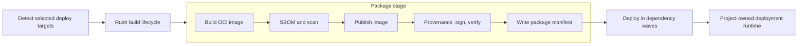

# Add First-Class OCI Application Image Artifacts

Baseline: `BootstrapLaboratory/rush-delivery` commit
`8de7f737c51008340ec1d5b489fb045b95c3cd07`, released as `v0.7.1`.

This task is owned and implemented by this Rush Delivery repository. It is a
public metadata, Dagger API, GitHub Action, package-manifest, and workflow
behavior change, so it is planned for the next minor release, `v0.8.0`.

## Context

Rush Delivery already owns source acquisition, affected-target detection,
validation, the Rush build lifecycle, deploy-artifact packaging, deployment
waves, dry runs, and optional npm package release. Project-specific behavior
remains in `.dagger` metadata and repository scripts.

The current package-target contract supports:

- `artifact.kind: directory`;
- `artifact.kind: rush_deploy_archive`.

The generated `.dagger/runtime/package-manifest.json` therefore contains only
`directory` or `archive` artifacts with filesystem `path` and `deploy_path`
fields. The deploy executor exposes those artifacts through `ARTIFACT_PATH`.

That contract cannot represent an application container built once, published
once, and consumed by Cloud Run, Docker Swarm, Kubernetes, or another deploy
script through an immutable digest reference. Building the image in a deploy
script would also mix Package and Deploy responsibilities.

## Goal

Add a provider-neutral `oci_image` package artifact that Rush Delivery can:

1. build from the already-built Dagger workspace;
2. scan and describe with verifiable supply-chain evidence;
3. publish to a selected OCI registry during the Package stage;
4. record by canonical digest in the package manifest; and
5. pass to an existing metadata-owned deploy script without rebuilding it.

Preserve existing directory/archive behavior, provider `off`, dry-run safety,
metadata-driven target behavior, stage boundaries, and thin CI wrappers.

## Repository And Toolchain Alignment

- Use Node.js 24 and TypeScript 5.9, matching the current repository.
- The root dependency lock is Yarn v1, and framework setup/self-check uses
  `yarn install --frozen-lockfile`. The documented direct QA commands are
  `npm run typecheck` and `npm test`; use those names in this task.
- Use Dagger-native `Directory.dockerBuild`, `Container.publish`, registry
  authentication, secrets, files, and directories. Do not require a host Docker
  daemon, Docker CLI, or `dockerSocket` to build or publish application images.
- Dagger engine `v0.20.7` already exposes the required build, registry-auth, and
  publish APIs. This feature does not require an engine upgrade.
- Align the GitHub Action's currently stale `dagger-version` default from
  `v0.20.6` to `v0.20.7`, matching [`../dagger.json`](../dagger.json) and
  [`../.devcontainer/Dockerfile`](../.devcontainer/Dockerfile).
- If implementation discovers that a newer Dagger engine is actually required,
  stop and update `dagger.json`, the devcontainer `DAGGER_VERSION`, the Action
  default, the installed CLI, and generated SDK together according to
  [`../.ai/conventions.md`](../.ai/conventions.md). Confirm `dagger version`
  before regenerating or testing the module.
- Run `dagger develop` only with the matching engine/CLI when generated SDK
  refresh is required; do not hand-edit generated files under `sdk`.
- Run SBOM, scanner, provenance, and signing tools in Dagger containers pinned
  by immutable image digest. Do not depend on tools preinstalled on the host.

## Architectural Position

OCI publication is an internal Package operation, not a new public stage.
Package must finish all selected artifacts before Deploy can begin.



The existing public stages retain these responsibilities:

| Stage   | Responsibility |
| ------- | -------------- |
| Detect  | Select deploy targets from Rush affected-project results, deploy tags, force inputs, and the services mesh. |
| Build   | Run the declared Rush lifecycle and create compiled outputs. |
| Package | Materialize filesystem or OCI deploy artifacts and write the package manifest. OCI registry publication is a Package side effect. |
| Deploy  | Consume packaged filesystem paths or immutable image references and run metadata-owned deploy scripts. |

Application images remain separate from Rush Delivery toolchain images and
Rush installation caches. Do not reuse their metadata, provider names, image
namespaces, retention rules, or result models.

## Fixed Design Decisions

- A package/deploy target still produces exactly one artifact. Several
  application images use several existing targets and the services mesh.
- An OCI target builds after the normal Rush build. The standalone
  `packageDeployTargets` entrypoint treats its input repository as already
  built; it must not run the Rush lifecycle for an OCI image.
- Build from a repository-relative context and Dockerfile in the packaged
  Dagger `Directory`, not from a host checkout.
- The initial `v0.8.0` contract supports exactly one explicit platform per OCI
  target. This avoids ambiguous index, per-platform evidence, and digest
  semantics. Multi-platform indexes require a follow-up public-contract task.
- Publish an OCI target once per workflow invocation. Use a deterministic
  `sha-<full-git-sha>` tag only as a registry navigation aid. Manifests,
  workflow results, and deploy scripts use only the digest returned by Dagger.
- Registry publication is not transactional. If signing or verification fails
  after publication, the image/tag may remain in the registry, but Rush
  Delivery must not emit a successful manifest or start Deploy.
- Registry and signing credentials are Dagger secrets. Never use them as
  Docker build arguments, write them into the packaged workspace, include them
  in manifests, pass them to deploy scripts, or print them.
- `applicationImageProvider: off` remains valid when no selected target is OCI
  and for all dry runs. A live selected OCI target with provider `off` fails
  before image build, publication, or deployment.
- Dry runs normalize metadata and emit a planned OCI artifact without building,
  scanning, publishing, signing, or inventing a digest/evidence result.
- Directory/archive-only packaging keeps emitting the current unversioned
  manifest so existing consumers retain the same output. A selection containing
  any OCI artifact emits the v2 manifest envelope. Deploy accepts both.
- Legacy unversioned parsing retains its current compatibility rules. Strict
  unknown-field rejection applies to the new v2 envelope and artifacts.
- Keep language- and product-specific build behavior in Rush projects and
  Dockerfiles. Do not add framework-specific branches for Node, Python, React,
  NestJS, or a deployment platform.

## Public Package Metadata Contract

Extend `.dagger/package/targets/<target>.yaml`:

```yaml
# yaml-language-server: $schema=https://bootstraplaboratory.github.io/rush-delivery/schemas/v0.8.0/package-target.schema.json
name: control-plane-api

artifact:
  kind: oci_image
  context: .
  dockerfile: deploy/images/control-plane-api.Dockerfile
  image: control-plane-api
  platform: linux/amd64
  scan:
    fail_on:
      - high
      - critical
    ignore_file: .dagger/application-images/vulnerability-ignore.yaml
```

Contract rules:

- `context` and `dockerfile` are normalized repository-relative paths: no
  absolute paths, parent traversal, empty segments, or paths outside the
  repository. The canonical `context: .` repository root is allowed.
- The metadata contract verifies that the context directory and Dockerfile
  exist. The Dockerfile must resolve inside the context and is passed to
  `Directory.dockerBuild` relative to that scoped context directory.
- Reject a Dockerfile symlink rather than following it outside the declared
  build context. The Dagger context directory remains the hard build boundary.
- `image` is a normalized relative OCI repository suffix, not a registry
  address, tag, or digest.
- `platform` is required for `v0.8.0` and must be a normalized Dagger/OCI
  platform supported by the pinned engine. Do not default it from the runner.
- `scan.fail_on` is required, unique, and limited to documented normalized
  severities. `ignore_file` is optional, repository-relative, and validated by
  the metadata contract when present.
- The initial contract has no build arguments, build secrets, SSH mounts, or
  arbitrary Dockerfile target selection. Add those only through a later public
  metadata design.
- Add trusted `org.opencontainers.image.revision` from the full workflow SHA.
  Add `org.opencontainers.image.source` only when a normalized source repository
  URL was supplied; do not guess it from the execution host. Do not invent an
  application version label.

## Application-Image Provider Contract

Use the exact metadata path `.dagger/application-images/providers.yaml`, kept
separate from `.dagger/toolchain-images/providers.yaml`:

```yaml
# yaml-language-server: $schema=https://bootstraplaboratory.github.io/rush-delivery/schemas/v0.8.0/application-image-providers.schema.json
providers:
  release:
    kind: oci_registry
    registry: europe-west1-docker.pkg.dev
    repository_prefix: example/platform
    username_env: OCI_USERNAME
    token_env: OCI_TOKEN
    signing_key_env: OCI_SIGNING_KEY
    signing_password_env: OCI_SIGNING_PASSWORD
    verification_key_env: OCI_SIGNING_PUBLIC_KEY
```

Provider rules:

- `off` is reserved and is not declared in metadata. Other provider names are
  arbitrary normalized names selected through the Dagger/Action input.
- `registry` is an OCI registry authority without a URL scheme, path, tag,
  digest, or credentials. `repository_prefix` is a normalized repository path.
- The canonical repository is
  `<registry>/<repository_prefix>/<artifact.image>`.
- Provider metadata stores environment variable names, never credential values.
  Environment names follow the repository's existing uppercase env-name rules.
- The initial signing capability is key-backed Sigstore/cosign. Keyless/OIDC
  signing requires a follow-up provider-contract task rather than hidden GitHub
  assumptions.
- Read provider values from the existing workflow-plus-deploy environment
  overlay. Do not read the release-only overlay and do not introduce another
  general-purpose env file.
- In a dry run, validate provider metadata if a named provider is selected but
  do not resolve credential env values. With provider `off`, show the relative
  image/platform intent without fabricating a repository.
- In a live run, resolve only the selected provider's named values, convert
  credential values immediately to Dagger secrets, and fail before OCI build
  if any required value is absent.
- Add a root `schemas/application-image-providers.schema.json` and include it in
  the `v0.8.0` schema snapshot.

## Versioned Package Manifest

Add a public `schemas/package-manifest.schema.json` and a strict v2 envelope for
OCI or mixed-artifact output:

```json
{
  "schema_version": "rush-delivery-package-manifest/v2",
  "artifacts": {
    "control-plane-api": {
      "kind": "oci_image",
      "status": "published",
      "image": "control-plane-api",
      "repository": "europe-west1-docker.pkg.dev/example/platform/control-plane-api",
      "digest": "sha256:<digest>",
      "reference": "europe-west1-docker.pkg.dev/example/platform/control-plane-api@sha256:<digest>",
      "platforms": ["linux/amd64"],
      "source_revision": "<full-git-sha>",
      "evidence": {
        "sbom": {
          "format": "spdx-json",
          "subject_digest": "sha256:<image-digest>",
          "digest": "sha256:<sbom-document-digest>",
          "path": ".dagger/runtime/evidence/control-plane-api/sbom.spdx.json"
        },
        "scan": {
          "scanner": "<name-and-version>",
          "policy": ["high", "critical"],
          "result": "passed",
          "digest": "sha256:<scan-report-digest>",
          "path": ".dagger/runtime/evidence/control-plane-api/scan.json"
        },
        "provenance": {
          "format": "slsa-provenance-v1",
          "subject_digest": "sha256:<image-digest>",
          "digest": "sha256:<provenance-document-digest>",
          "path": ".dagger/runtime/evidence/control-plane-api/provenance.json"
        },
        "signature": {
          "kind": "sigstore",
          "reference": "<registry-signature-reference>",
          "verified": true
        }
      }
    }
  }
}
```

V2 rules:

- Filesystem artifacts in a mixed v2 manifest keep their existing `kind`,
  `path`, and `deploy_path` fields unchanged.
- A planned OCI artifact contains `kind`, `status: planned`, `image`, one
  `platforms` entry, and `source_revision`. It may include `repository` only
  when a named provider supplies one. It omits `digest`, `reference`, and
  evidence results.
- A published OCI artifact requires the complete evidence block. `published`
  means the image was published and its required evidence was produced and
  verified.
- Require a lowercase `sha256:<64 lowercase hex>` digest and exact
  `reference === repository + "@" + digest`.
- Require the full 40-character source SHA and validate it against the deploy
  call's `gitSha` before any live deploy executor starts.
- Evidence document digests describe the local evidence documents; they are
  not copies of the image digest. Evidence paths are normalized beneath the
  target-specific `.dagger/runtime/evidence/<target>/` directory.
- V2 rejects unknown top-level and artifact fields, mutable-tag-only live
  artifacts, malformed platforms, path escape, incomplete/false evidence,
  planned live artifacts, and repository/reference disagreement.
- Secret safety comes from the closed schema and construction path. Test with
  sentinel credentials and prove they do not occur in the manifest, logs,
  summaries, or returned JSON; do not attempt unreliable secret-name guessing.
- Continue parsing the existing unversioned manifest exactly as the current
  directory/archive compatibility contract requires.

## Deploy Runtime And Result Contract

Keep `ARTIFACT_PATH` unchanged for directory and archive artifacts. For a
published OCI artifact expose:

```text
ARTIFACT_KIND=oci_image
ARTIFACT_IMAGE_REFERENCE=<repository>@sha256:<digest>
ARTIFACT_IMAGE_REPOSITORY=<repository>
ARTIFACT_IMAGE_DIGEST=sha256:<digest>
ARTIFACT_IMAGE_PLATFORMS_JSON=["linux/amd64"]
ARTIFACT_SOURCE_REVISION=<full-git-sha>
ARTIFACT_EVIDENCE_DIR=/workspace/.dagger/runtime/evidence/<target>
```

- Do not set `ARTIFACT_PATH` for an OCI image.
- Add only the selected target's evidence directory to the deploy executor at
  `ARTIFACT_EVIDENCE_DIR`; do not broaden a partial runtime workspace.
- Deployment scripts receive no registry or signing credentials. Runtime image
  pulls remain the responsibility of the target platform and its identity.
- Dry-run summaries show planned image/platform/repository intent and clearly
  state that no image or digest was produced.
- Update the deploy-result model so image results can return
  `artifactKind`/`artifactReference` without a fake `artifactPath`; preserve the
  existing directory/archive JSON fields and deploy-only output shape.

## Supply-Chain Execution

For every live OCI target:

1. build the final Dagger `Container` for the declared platform;
2. generate and validate an SPDX JSON SBOM from that exact container;
3. scan the same container with a pinned scanner and enforce the metadata
   severity/ignore policy before publication;
4. publish with Dagger registry authentication and validate the returned digest
   reference;
5. generate provenance binding the source SHA, optional supplied source URL,
   package target, Dockerfile, context, platform, v2 manifest contract, and
   published digest;
6. sign and attach the digest/provenance with the selected key-backed Sigstore
   provider;
7. verify the signature and attestation against the configured verification
   key; and
8. only then write a `status: published` artifact and sanitized evidence files.

Dry runs do none of these operations. Failures before publication leave no
published image. Failures after publication may leave an unreferenced image or
navigation tag but must prevent Deploy and must be reported as a nontransactional
Package failure without exposing credentials.

## Implementation Phases

### Phase 1: Contract, Models, Schemas, And Compatibility Tests

- [ ] Add failing parser/model/schema tests for `artifact.kind: oci_image`.
- [ ] Add v2 manifest tests for filesystem, planned OCI, published OCI, and
      mixed artifacts.
- [ ] Preserve current unversioned manifest parsing and filesystem-only output.
- [ ] Add strict path, image, platform, digest, reference, source, evidence,
      and unknown-field validation.
- [ ] Add root `package-manifest` and `application-image-providers` schemas and
      extend the root package-target schema.
- [ ] Add schema-fixture coverage for every new schema and metadata shape.

### Phase 2: Provider And Environment Boundary

- [ ] Add an application-image provider model, parser, metadata path, schema,
      metadata-contract validation, option parser, and resolver.
- [ ] Support arbitrary named `oci_registry` providers plus reserved `off`.
- [ ] Resolve the selected provider from workflow-plus-deploy env only.
- [ ] Use Dagger secrets for registry token and signing material.
- [ ] Add provider-off, dry-run, missing-value, invalid-provider, env-collision,
      and sentinel-secret redaction tests.

### Phase 3: OCI Package Planning And Build

- [ ] Extend package planning with a typed OCI plan; do not hide OCI semantics
      in shell command strings.
- [ ] Build from the already-built packaged workspace with
      `Directory.dockerBuild`, the scoped context, Dockerfile, platform, and
      trusted labels.
- [ ] Prove OCI packaging does not rerun Rush install or lifecycle commands.
- [ ] Keep directory and Rush deploy archive plans/output unchanged.
- [ ] Add focused fixture coverage for filesystem-only, one OCI target, and
      multiple OCI targets.

### Phase 4: Evidence, Publication, And Manifest Handoff

- [ ] Pin and document the SBOM, scanner, and Sigstore tool images by digest.
- [ ] Generate, validate, hash, and store target-scoped evidence files.
- [ ] Enforce scan policy before publication.
- [ ] Publish each selected OCI target once and normalize Dagger's result to a
      canonical digest reference.
- [ ] Generate, attach, sign, and verify digest-bound provenance before marking
      the artifact published.
- [ ] Await all started target package operations and aggregate deterministic
      failures before returning; Deploy must not start after any package error.
- [ ] Test auth, scan, publication, signing, verification, partial multi-target,
      digest mismatch, evidence tampering, and redaction failures.

### Phase 5: Deploy Consumption And Results

- [ ] Extend the package-manifest model/parser/formatter, deploy target executor,
      dry-run summary, and deploy-result model for discriminated filesystem/OCI
      behavior.
- [ ] Expose immutable `ARTIFACT_IMAGE_*` values and only the selected target's
      evidence directory.
- [ ] Reject planned, mutable, malformed, source-mismatched, or unverified OCI
      artifacts before starting a live deploy script.
- [ ] Keep existing `ARTIFACT_PATH` and directory/archive result behavior.
- [ ] Add provider-shaped fixture scripts for Cloud Run, Swarm, and Kubernetes
      that only validate the digest handoff; keep provider deployment logic out
      of Rush Delivery.

### Phase 6: Dagger And GitHub Action API

- [ ] Add optional `gitSha`, `sourceRepositoryUrl`, `dryRun`, `deployEnvFile`,
      and `applicationImageProvider` inputs where required by
      `packageDeployTargets`; reuse existing `deployEnvFile`/`dryRun` inputs on
      `buildAndPackageDeployTargets` and `workflow`.
- [ ] Require a full `gitSha` only when a selected OCI target needs it. Keep old
      calls valid for directory/archive-only selections. Treat the source URL
      as optional identity and never derive it from host Git state.
- [ ] Thread only selected provider values into Package. Do not broaden build,
      npm-release, or deploy-runtime secret exposure.
- [ ] Add the Action input `application-image-provider`, defaulting to `off`,
      and argument-generation tests. Reuse `workflow-env` plus `deploy-env` for
      provider values; add no new generic env input.
- [ ] Follow [`../.ai/rules/BashModules.md`](../.ai/rules/BashModules.md) when
      modifying [`../github-action/prepare-workflow.sh`](../github-action/prepare-workflow.sh).
- [ ] Align the Action Dagger default to `v0.20.7`.
- [ ] Preserve standalone package/deploy handoff: the packaged directory carries
      the manifest/evidence while the image itself is addressed in the registry.
- [ ] Return machine-readable OCI artifact summaries using canonical digest
      references without changing filesystem-only workflow output.

### Phase 7: Documentation And v0.8.0 Release Preparation

- [ ] Before editing root docs, add `v0.7.1` to `publishedVersions` in
      [`../website-docusaurus/scripts/sync-versioned-docs.mjs`](../website-docusaurus/scripts/sync-versioned-docs.mjs),
      run `npm --prefix website-docusaurus run sync-versioned-docs`, and verify
      the generated `docs-versions` snapshot against the immutable `v0.7.1`
      tag.
- [ ] Do not add a `v0.7.1` schema directory: it was a docs/tooling-only patch
      and the exact public schema contract remains `v0.7.0`.
- [ ] After finalizing root schema changes, create immutable `schemas/v0.8.0`
      copies of every current root schema, including the two new schemas, with
      matching versioned `$id` URLs.
- [ ] Update root docs and examples to exact `v0.8.0` Action/module and schema
      references. Update Docusaurus `currentDocsVersion` and both site homepages.
- [ ] Update API, entrypoint, metadata, provider, workflow, quick-start, GitHub
      Action, development, and tutorial documentation. Update both docs trees if
      a page is added or renamed.
- [ ] Document generic registry configuration, filesystem-only compatibility,
      digest-only deployment, dry runs, provider `off`, credential boundaries,
      evidence policy, post-publication failure, retention, and rollback.
- [ ] Do not modify existing versioned schema or documentation snapshots by
      hand. Root `package.json` has no project version to bump; Rush Delivery's
      release version is represented by the Git tag and published references.

### Phase 8: Verification

- [ ] Install root dependencies with `yarn install --frozen-lockfile` when a
      clean install is needed.
- [ ] Run `npm run typecheck`.
- [ ] Run `npm test`, including schema fixtures and metadata-contract tests.
- [ ] Run `npm run site:docusaurus:check` and
      `npm run site:docusaurus:build`.
- [ ] Run `npm run site:check` and `npm run site:build`.
- [ ] Run `git diff --check` and `trunk check -a -y`.
- [ ] Confirm `dagger version` matches `dagger.json`, then run
      `dagger call ping` and `dagger call self-check`.
- [ ] Run an isolated disposable-registry acceptance test proving Dockerfile
      build, pre-publish scan, one publication, canonical digest manifest,
      evidence verification, and digest-only deploy handoff.
- [ ] Prove existing directory/archive fixtures and filesystem-only workflow
      result JSON remain unchanged.

## Required Test Matrix

| Case | Expected result |
| ---- | --------------- |
| Existing directory target | Same unversioned manifest, artifact path, deploy behavior, and result shape. |
| Existing Rush archive target | Same unversioned manifest, archive/deploy paths, behavior, and result shape. |
| Mixed filesystem and OCI targets | Strict v2 manifest; each artifact keeps its discriminated contract. |
| OCI, provider off, dry run | Planned relative image/platform summary; no credentials, build, evidence, publish, digest, or deploy side effect. |
| OCI, named provider, dry run | Planned repository/image/platform summary; credential values are not resolved. |
| OCI, provider off, live | Fail before OCI build, publication, or deploy side effects. |
| OCI, named provider, live | One publish; verified evidence; canonical digest manifest; deploy receives digest only. |
| Two OCI targets | Package independently; await both; deterministic complete result or aggregated failure; no deploy after failure. |
| Registry authentication failure | Sanitized failure; no deploy; no secret in logs, manifests, evidence, or results. |
| Scanner policy failure | No publication or deploy; identify target/policy without leaking protected data. |
| Post-publication signing failure | No successful manifest or deploy; report possible orphaned registry artifact. |
| Signature/attestation verification failure | Artifact is not marked published and deploy does not start. |
| Planned manifest passed to live deploy | Reject before deploy script execution. |
| Mutable tag substituted for digest | Reject. |
| Source revision mismatch | Reject. |
| Legacy unversioned manifest | Parse with existing directory/archive semantics. |

## Non-Goals For v0.8.0

- Cloud Run, Docker Swarm, Kubernetes, registry-vendor, or product-specific
  deployment code in Rush Delivery.
- Multi-platform OCI indexes; create a follow-up public-contract task.
- Docker build arguments, Docker build secrets, SSH forwarding, or arbitrary
  build-stage selection.
- Keyless/OIDC signing or cloud-specific signing services; add them later as
  explicit provider capabilities.
- Application-language/framework build logic.
- Building application images in deploy scripts.
- Passing registry/signing credentials to application builds or deploy
  runtimes.
- Replacing the services mesh, toolchain-image cache, Rush cache, or npm package
  release feature.
- Requiring OCI provider metadata or credentials for unaffected targets,
  validation, metadata checks, filesystem-only flows, or provider-off dry runs.
- Editing released versioned schema or documentation snapshots.

## Completion Criteria

- `oci_image` is a documented, schema-validated public package artifact for one
  explicit platform.
- A trusted live workflow builds each selected image once, scans it, publishes
  it once, verifies digest-bound evidence, and records the canonical reference.
- Project deploy scripts can consume the same digest-pinned image without a
  framework change or rebuild.
- Dry runs and provider `off` remain safe, useful, and credential-free.
- Existing filesystem-only metadata, manifests, deploy behavior, and workflow
  output remain compatible.
- No registry/signing credential appears in build inputs, source artifacts,
  manifests, evidence, image history, logs, dry-run output, or returned results.
- Root docs, `v0.7.1` archived docs, `v0.8.0` schema snapshots, GitHub Action
  inputs, Dagger API, fixtures, and tests agree with the released contract.
